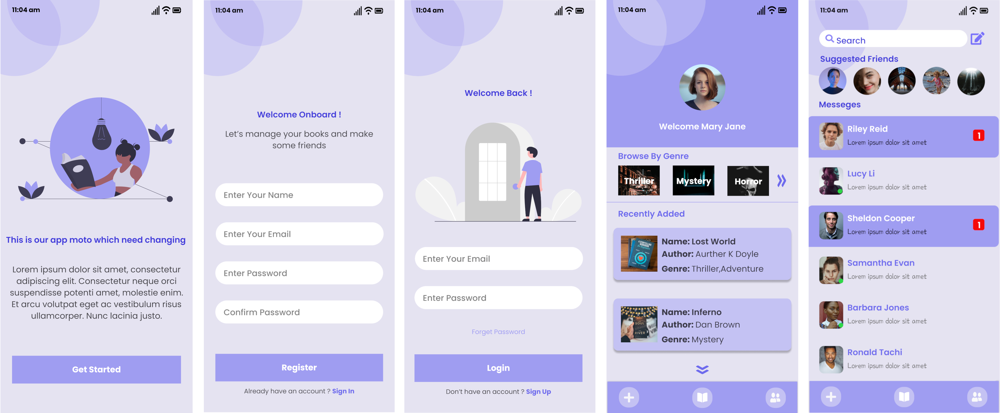

## Book-Ally

---

A Social Networking app based on users book interest



## Requirement

---

1. Node (10.19.0)
2. NPM (6.14.6) or Yarn (1.22.5)

## Installation

---

```
npm i -g create-react-native-app // this command may need super user access
git clone https://github.com/mirsahib/BookAlly-Mobile.git
cd book-ally-mobile

# Install npm dependencies
npm install;
```

## Features

---

- Create user account
- Upload user book information
- Get friend suggestion based on the users book interest
- Get connect with new friends who have similar book interest
- Messaging platform

## Folder Structure

---

### app

Contains application source code

#### app/ ** test **

Contains generic test files. We should write test for components, services etc. inside of related folder.

#### app/components

Contains stateless, lean components. We can use anywhere without big updates. When writing code we do not forget KISS.

#### app/config

Contains static datas of app. With this folder, we can manage all static fields by one location.

#### app/containers

Contains screen of app. You can create sub container components in related container.

##### app/containers/{containerName}.js

It is presentational segment of component.It must be stateless.Do not write business logic and do not bind redux.

##### app/containers/{containerName}Container.js

It is business and flow segment of component. It must contain only related presentational component.

#### app/helper

Contains util and helper class. These functions must be simple.

#### app/images

Contains images.

#### app/redux/modules

Contains feature based redux elements. Every module must be same name with related container.

##### app/redux/modules/{ModuleName}.js

It must be contain action types, actions and reducer. We want keep simple every changes.
If we split these domains to seperate files, When add a new action, a lot of file affected. We escaping this case.

##### app/redux/middlewares

Contains first-party middlewares.

#### app/services

Contains wrappers of services.

## Contribution Process

---

If you want to **contribute** and make this project much better for other developer have a look at [Issues](https://github.com/mirsahib/BookAlly-Mobile/issues).

**Pull Request for contributor**

Before making a PR request you must follow the following workflow:

- fork then clone _your_ remote repository
- make some changes to _your local repository_
- add and commit the changes to _your local development branch_
- push the changes to _your remote development branch_
- make a pull request from _your remote development branch_

**Pull Request for collaborator**

- Clone the repository (skip this step if you get promoted from contributor to collaborator)
- make some changes to your local repository
- add and commit the changes to _your local development branch_
- push the changes to _your remote development branch_
- make a pull request from _your remote development branch_

<span style="color:red">**DO not push code to master branch, I repeat do not push code to master branch.**</span>

## Special Thanks

---

[Asim Olmez](https://github.com/asimolmez)
